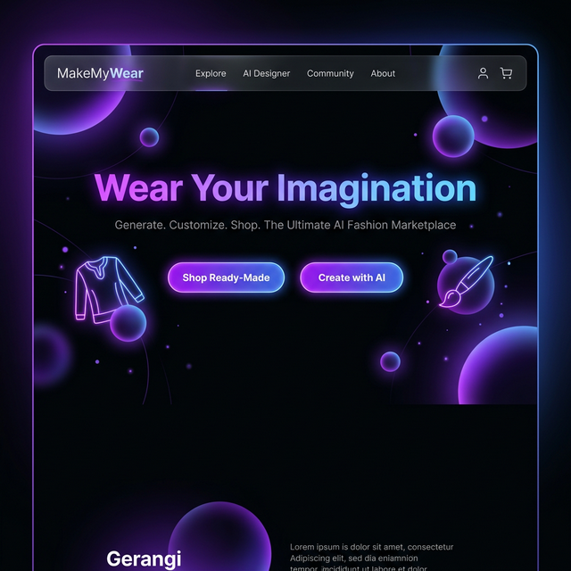
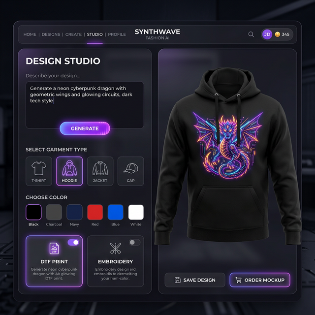
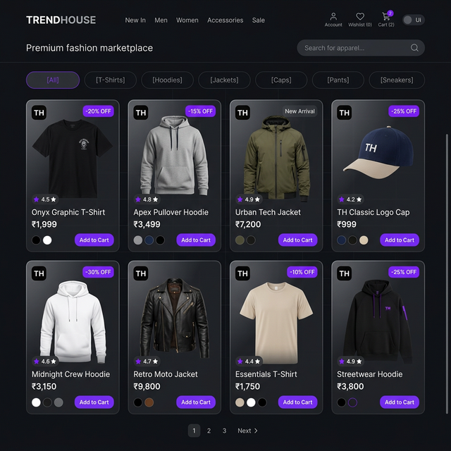
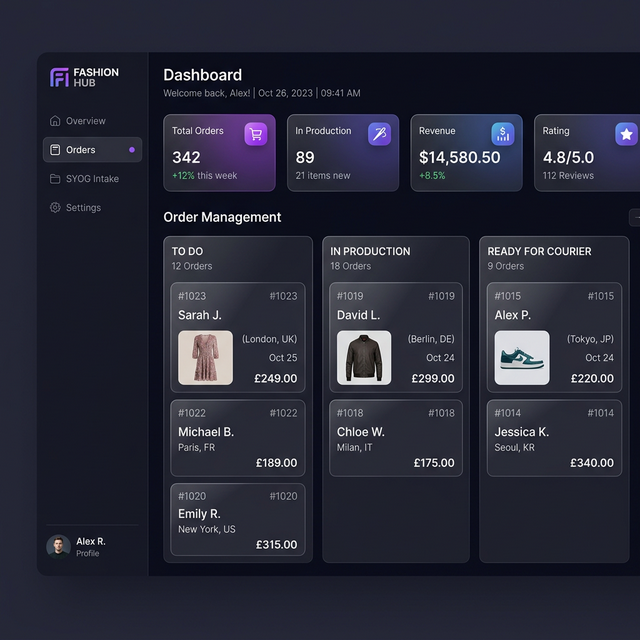
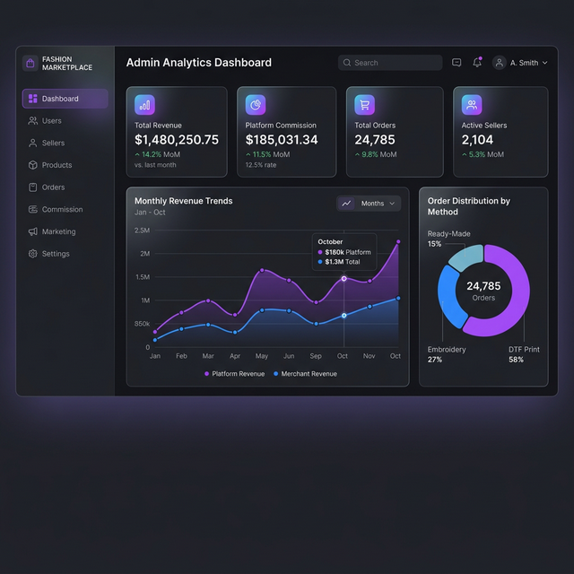
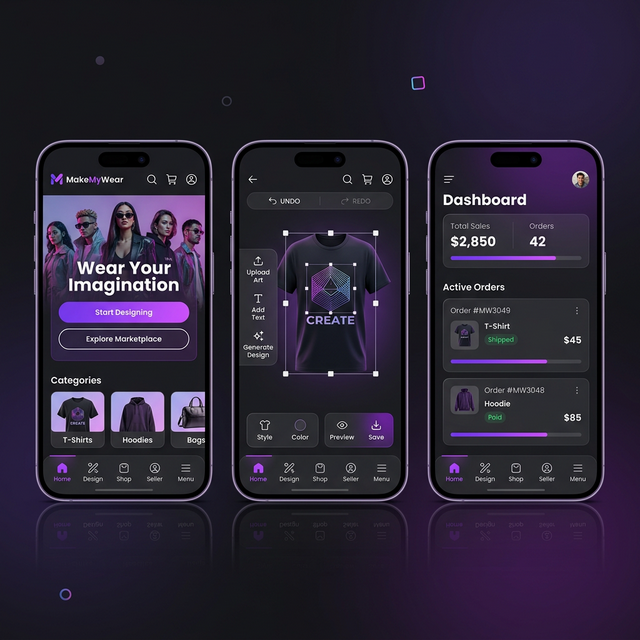

<div align="center">
  

# MakeMyWear 👕✨

**Wear Your Imagination. AI-Powered Fashion Customization Marketplace.**

[Live Demo](#) · [Report Bug](#) · [Request Feature](#)

  <br />
</div>

## 🌟 Overview

MakeMyWear is a hybrid fashion and AI customization marketplace MVP. It allows users to buy ready-made clothes, generate custom designs using AI, and order them to be printed (DTF) or embroidered. Users can also send their own garments (SYOG) for customization.

**Key Features:**

- **Customer Storefront:** Browse ready-made products, use the AI Design Studio, and view the community inspiration feed.
- **AI Design Studio:** Text-to-image generation mapped onto 3D 360-degree rotating garments (T-shirts, hoodies, jackets, etc.).
- **SYOG (Send Your Own Garment):** A unique flow allowing users to send their existing clothes for custom printing or embroidery.
- **Seller Dashboard:** Manage incoming orders with a Kanban board, view hyperlocal matching, and download print-ready (PNG) or embroidery-ready (DST) files.
- **Super Admin Panel:** Comprehensive analytics with Recharts, vendor management, and payout settlement.
- **PWA Ready:** Installable on mobile devices (Android/iOS) and desktop for a native app-like experience.

<br />

## 📸 Screenshots

### AI Design Studio & 3D Mockup

Generate designs and see them live on your selected garment.


### E-Commerce Shop

Browse and filter ready-made apparel.


### Seller Dashboard

Manage orders, download files, and process SYOG intakes.


### Admin Analytics

Track platform revenue, commissions, and manage vendors.


### Mobile Responsive & PWA

Fully optimized for mobile devices with an installable PWA experience.


<br />

## 🛠️ Technology Stack

- **Framework:** Next.js 14 (App Router)
- **Styling:** Tailwind CSS v3, Custom Custom CSS Variables
- **UI Components:** Shadcn UI (Radix Primitives)
- **Icons:** Lucide React
- **Animations:** Framer Motion
- **Charts:** Recharts
- **Theming:** `next-themes` (Dark/Light mode support)

<br />

## 🚀 Getting Started

To get a local copy up and running, follow these steps.

### Prerequisites

- Node.js (v18.17 or higher)
- npm

### Installation

1.  Clone the repository
    ```bash
    git clone https://github.com/prashant13-bh/Artify.git
    ```
2.  Navigate to the project directory
    ```bash
    cd Artify
    ```
3.  Install NPM packages
    ```bash
    npm install
    ```
4.  Run the development server
    ```bash
    npm run dev
    ```
5.  Open [http://localhost:3000](http://localhost:3000) in your browser.

<br />

## 📱 PWA Installation

MakeMyWear is configured as a Progressive Web App (PWA).

1.  **Desktop:** Click the install icon in the address bar (Chrome/Edge).
2.  **Android:** Open the site in Chrome, tap the menu (⋮), and select "Install app".
3.  **iOS:** Open the site in Safari, tap the Share button, and select "Add to Home Screen".

<br />

## 🎨 Design System

The application uses a premium, modern design system:

- **Theme:** Dark mode default with light mode support.
- **Colors:** Deep background (`#09090b`) with Electric Purple (`#6C3CE1`) and Neon Blue (`#3CE1D9`) accents.
- **Effects:** Heavy use of glassmorphism (frosted glass) and subtle glowing animations.
- **Typography:** Clean, sans-serif fonts optimized for readability and a tech-forward feel.

---

_Designed & Built for the Future of Fashion._
